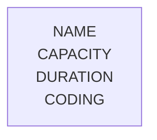
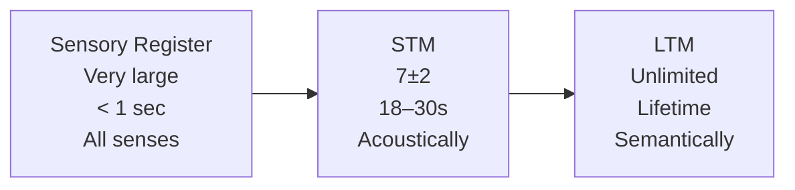

# The Multi-Store Model of Memory

## Overview

## Memory Stores

### Sensory Register

The **sensory register** encodes all sensory information from the environment. However, information only moves into **STM** if attention is paid to it. Without attention, information remains in the sensory register for under half a second before being discarded.

### Short-Term Memory (STM)

When attention is paid to sensory information, it transfers into **STM**. The STM has a capacity of **7±2 items** and a duration of approximately **18–30 seconds**. Information in STM is typically encoded **acoustically**.

### Long-Term Memory (LTM)

Information that is sufficiently rehearsed or meaningful can transfer to **LTM**, where it can potentially be stored for a **lifetime**. The LTM has **unlimited capacity** and encodes information primarily **semantically**.

## Evaluation

### Strengths

- **Evidence of multiple memory stores** — Murdock's serial position curve study supports the distinction between STM and LTM.
- **Case study support** — Clive Wearing demonstrates the existence of separate memory stores, as he is unable to transfer information from STM to LTM.

### Weaknesses

- **Oversimplification** — The MSM lacks critical detail and may therefore be incomplete. For example, research identifies three distinct types of LTM, none of which are accounted for by the model.

## Primacy and Recency Effects in Recall

### Primacy Effect

The first words in a list are remembered well because they have been rehearsed the longest and have therefore been transferred to **LTM**.

### Recency Effect

The most recent words are remembered because they are still held in **STM**.

## Murdock's Serial Position Curve Study

### Aim

Murdock aimed to investigate whether the position of a word within a list would affect the likelihood of it being recalled.

### Method

Participants listened to lists of twenty words, drawn from the four thousand most common English words. List length varied from ten to forty words. After each list, participants were asked to recall the words they had heard.

### Results

- Participants recalled more words from the **beginning** of the list — the **Primacy Effect**.
- Participants also recalled a large number of words from the **end** of the list — the **Recency Effect**.

### Conclusion

Words at the start of a list are remembered well because they have been rehearsed longest and have entered **LTM**. Words at the end are remembered because they remain in **STM**. Therefore, the position of a word in a list does affect recall.

### Evaluation

#### Strengths

- **Reliability** — Murdock repeated the study hundreds of times across many individual groups of students.
- **Real-world application** — The findings can be applied to everyday situations. For example, a speaker can place key points at the start and end of a speech to maximise recall.
- **Ethical** — The study does not violate ethical guidelines.

#### Weaknesses

- **Limited generalisability** — All participants were university psychology students, making it difficult to generalise findings to wider populations.
- **Low ecological validity** — Memorising word lists is not representative of how memory operates in everyday life.

---

# Flashcards

#flashcards/psychology/memory/structures-of-memory

What is the capacity of STM?::7±2 items

What is the duration of STM?::18–30 seconds

How is information encoded in STM?::Acoustically

How is information encoded in LTM?::Semantically

What is the capacity of LTM?::Unlimited

What is the duration of LTM?::Potentially a lifetime

What happens to information in the sensory register if attention is not paid to it?::It is discarded after less than half a second

What does Clive Wearing's case study demonstrate?::That STM and LTM are separate memory stores, as he cannot transfer information from STM to LTM

What is a weakness of the multi-store model?::It is oversimplified — for example, it does not account for the three distinct types of LTM

What is the Primacy Effect?
?
The tendency to remember words from the beginning of a list because they have been rehearsed the longest and stored in LTM

What is the Recency Effect?
?
The tendency to remember words from the end of a list because they are still held in STM

Murdock's serial position curve — Aim
?
To investigate whether the position of a word in a list affects how well it is recalled

Murdock's serial position curve — Method
?
Participants listened to word lists of varying length (10–40 words) drawn from the 4,000 most common English words, then recalled as many as possible

Murdock's serial position curve — Results
?
More words were recalled from the start (Primacy Effect) and end (Recency Effect) of the list; fewest words were recalled from the middle

Murdock's serial position curve — Conclusion
?
Word position does affect recall. Early words enter LTM through rehearsal; late words remain in STM. This supports the multi-store model

Murdock's study — Strengths
?
- High reliability due to repetition across many participant groups
- Real-world application (e.g. structuring speeches)
- Ethically sound

Murdock's study — Weaknesses
?
- Limited generalisability — participants were all university psychology students
- Low ecological validity — memorising word lists does not reflect everyday memory use